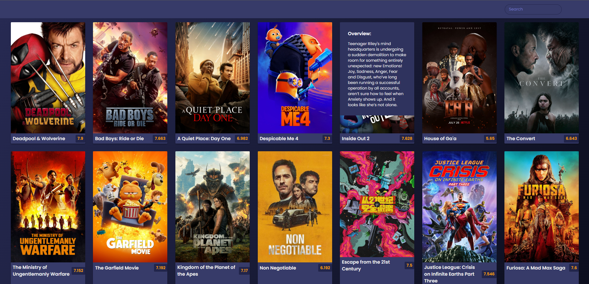

# Day 10 - Movie App

HTML, CSS, JavaScript

Similar to previous day, practicing DOM manipulation with fetching data from an API. Integrated previous day's movie card page when clicking on a movie title for a multi-page app, where the movie card loaded is based on the webpage url.

