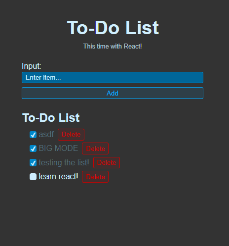

# Day 12 - To-Do List with ReactJS and Vite

React, Vite

Beginning of learning ReactJS, starting with a simple to-do list, which I have previously created with vanilla HTML and JavaScript, allowing me to compare and notice the differences in development. The project uses Vite.

