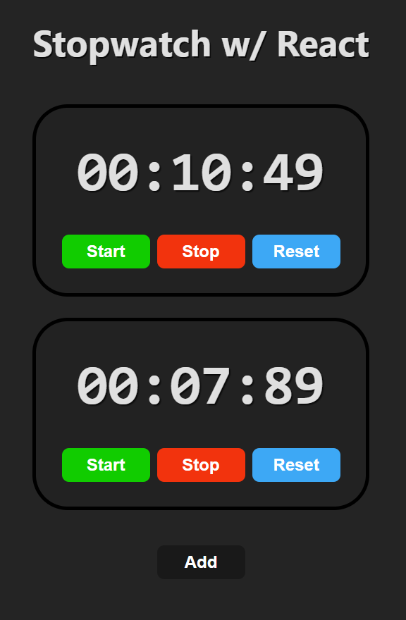

# Day 14 - Stopwatch with React

React, Vite

Continuing to learn React, this project is another short exercise to become familiar with working in a React environment. In contrast to previously making a stopwatch, rather than directly manipulating the DOM through JavaScript, I use JavaScript to control what is returned by the components in React.

