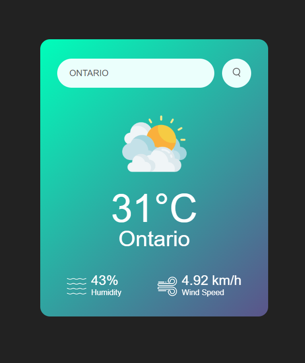

# Day 1 - Weather App

HTML, CSS, JavaScript

For the first day, having very little knowledge of HTML, CSS and Javascript, I mostly followed a tutorial on Youtube to help learn the very basics of each, while adding some of my own experimentation.

