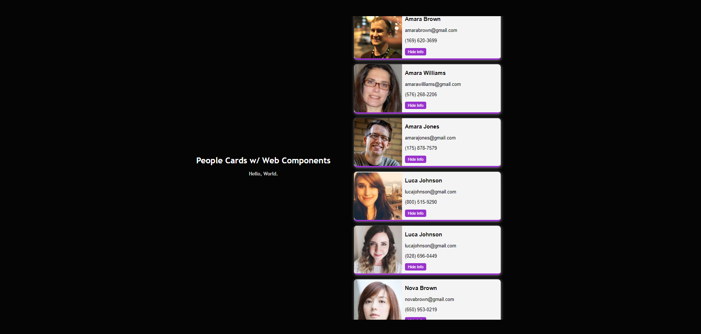

# Day 24 - Web Components

HTML, CSS, JavaScript

Taking a break from React, I learned about Web Components, and utilized HTML templates, custom elements, and the shadow DOM to create this webpage with scrollable, randomly generated people cards.

