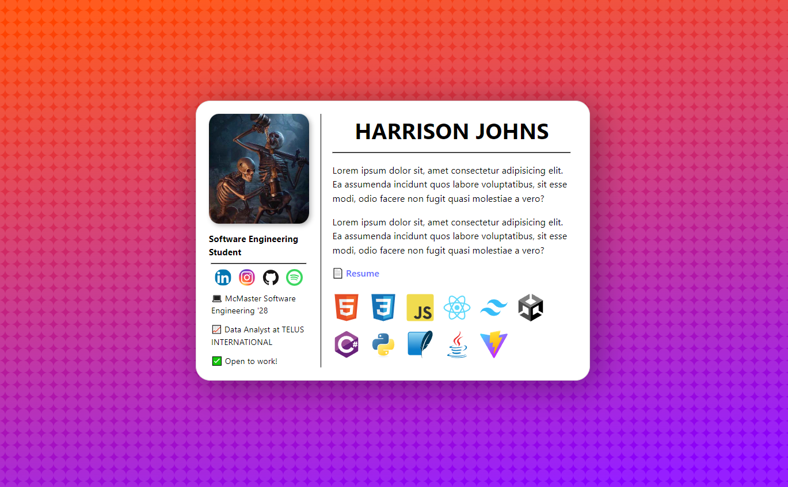
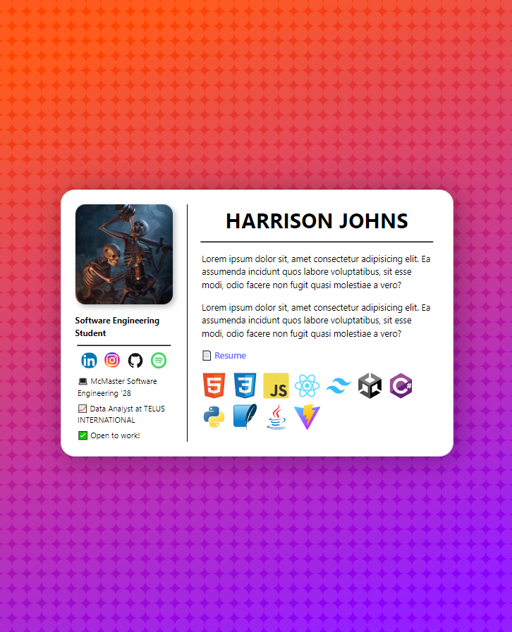
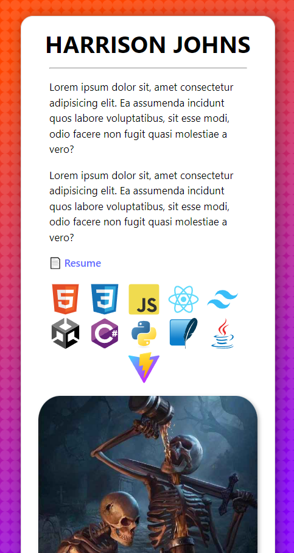
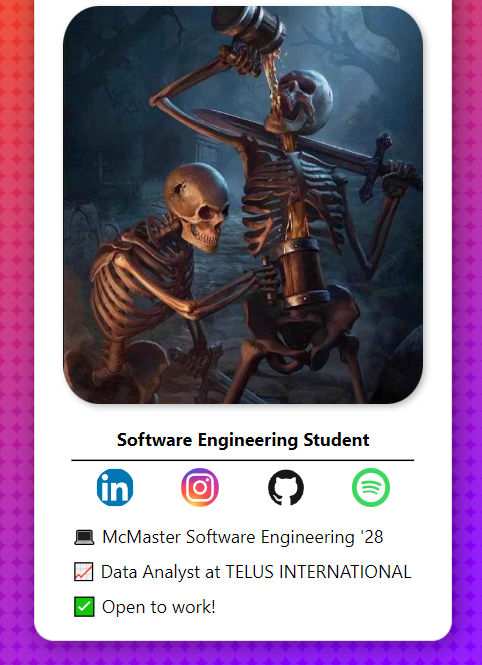

# Day 26, 27 - Responsive Mini-Portfolio

React, Vite

I decided to learn about responsive CSS to make content look good on any screen size. At the same time, I wanted to create some sort of temporary mini-portfolio, not to show projects but display information about msyelf. I combined these to create this (with working links, previous resume, and accurate information)!

