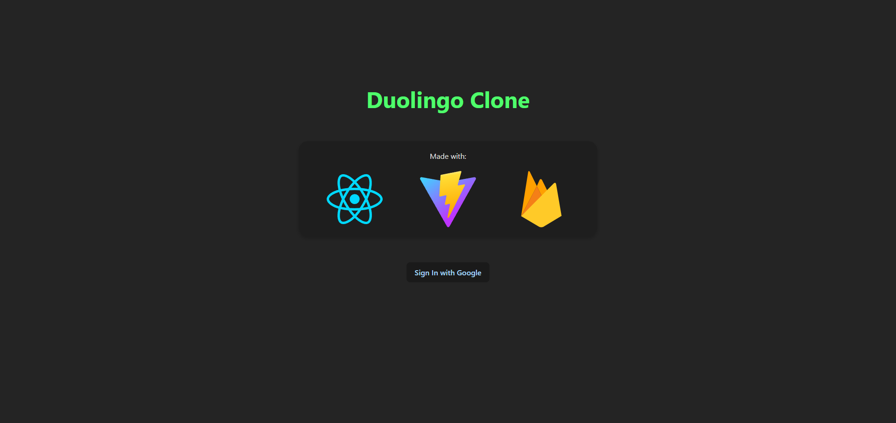
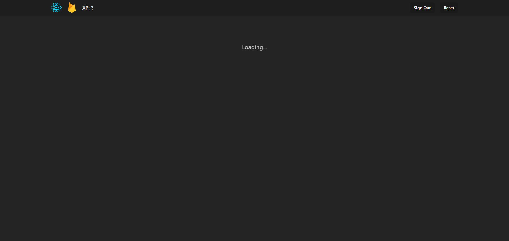
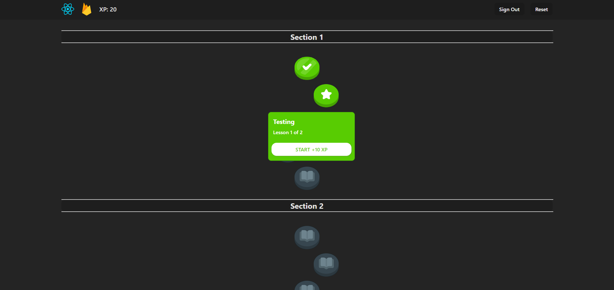
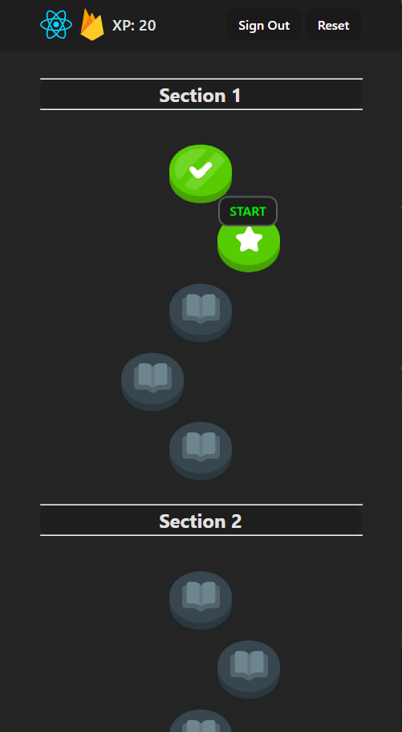
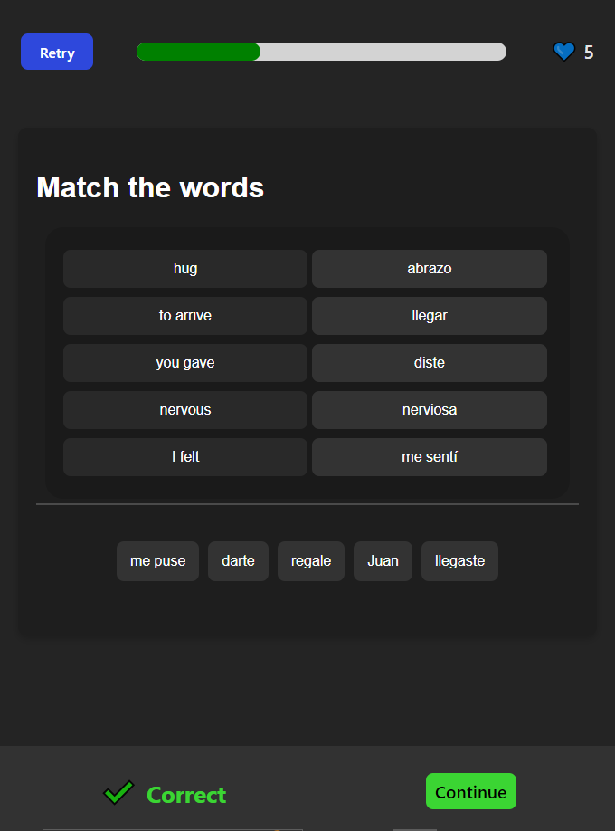
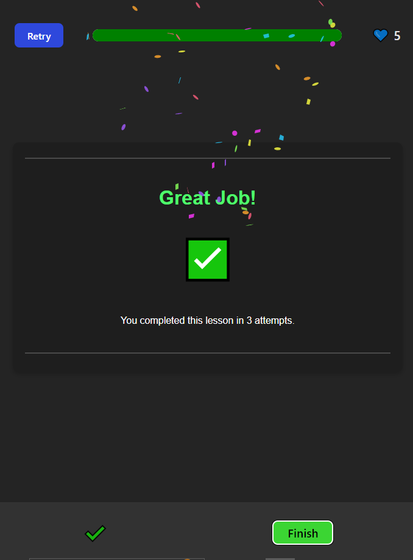

# Day 28, 29, 30 - Duolingo Learn Page

React, Vite, Firebase

For the final project of these 30 days, I combined and heavily updated the previous Duolingo clone projects with Firebase's Cloud Firestore Database to create a fully-working Duolingo clone app (although the contents are mostly test data). I spent time learning the basics of Firebase to make sure the app worked properly, and in impleneting Firebase into the project I added a sign-in page, loading screens, and user data being saved. 
Additionally, applying my learning from the project before this, the app incorporates responsive CSS to look good at any screen size!

