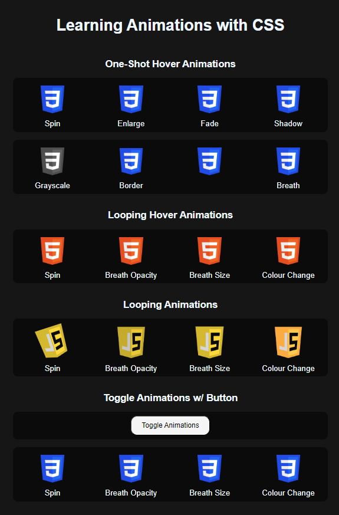

# Day 2 - Learning Animations & Transitions

HTML, CSS, JavaScript

I used this day to learn about basic CSS animations and transitions, and how they can be manipulated. I created a short webpage to encompass my learning.

