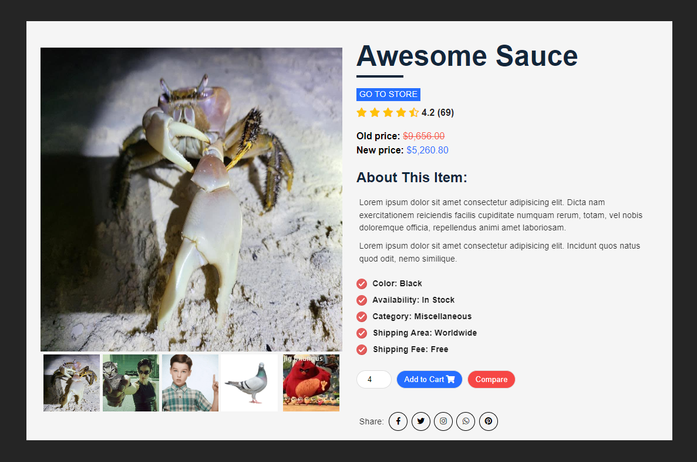

# Day 3 - Product Page

HTML, CSS, JavaScript

Still using HTML, CSS, and JavaScript, I made a product page, partially following a tutorial. With this project I wanted to focus more on JavaScript to make the site more interactive, and make use of the CSS transitions and animations I had learned the previous day.

