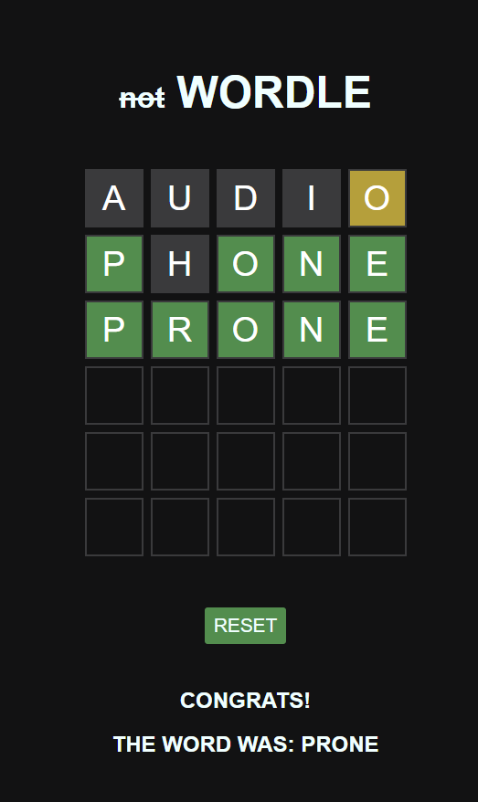

# Day 4 - Wordle Clone

HTML, CSS, JavaScript

For this day, I continued to learn and practice HTML, CSS, and JavaScript. I watched a tutorial before then tried to replicate what I had learned, and additionally added some data fetching from a txt file, which was new to me in JavaScript.

