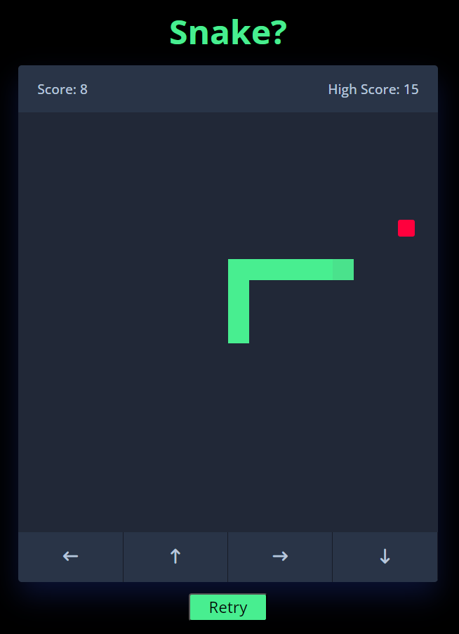

# Day 5 - Simple Snake Game

HTML, CSS, JavaScript

For this day, I continued to learn and practice HTML, CSS, and JavaScript, but I wanted to try to make a simple game. I watched a tutorial before then tried to replicate what I had learned, while tuning it to my preferences. I also learned about saving data to a browswer and retrieving it. 

