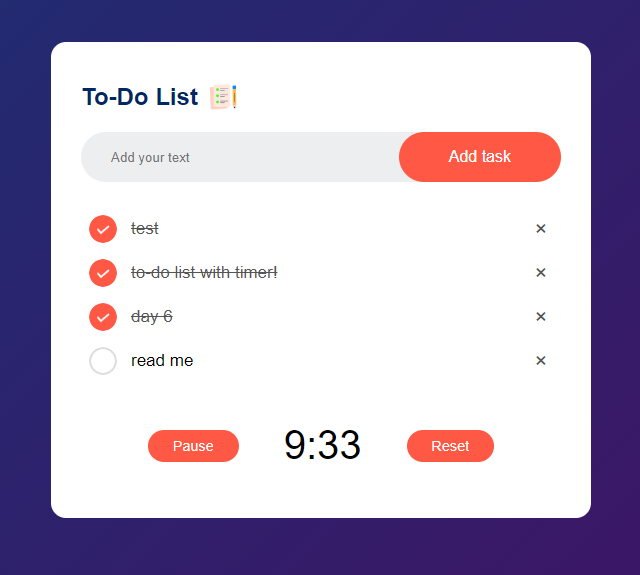

# Day 6 - Simple To-Do List and Timer

HTML, CSS, JavaScript

I continued to learn and practice HTML, CSS, and JavaScript, learning about directly modifying the DOM and the HTML through JavaScript. I also further exercised saving and retrieving data (saving list items and time on the timer).

