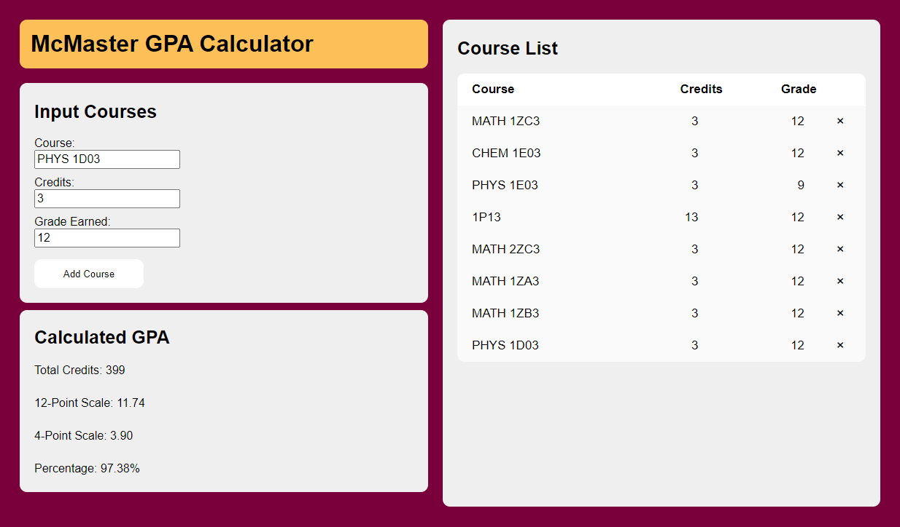

# Day 8 - McMaster GPA Calculator

HTML, CSS, JavaScript

Using what I had recently learned with HTML, CSS, and JavaScript, I set out consolidate my knowledge by making something that is useful to me, a grade calculator for my university's GPA scale.

